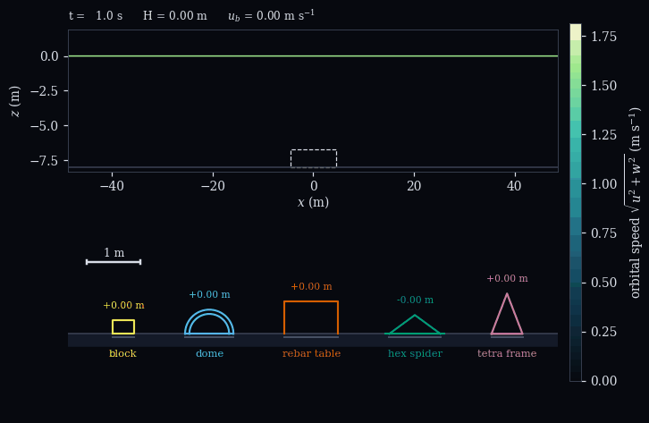
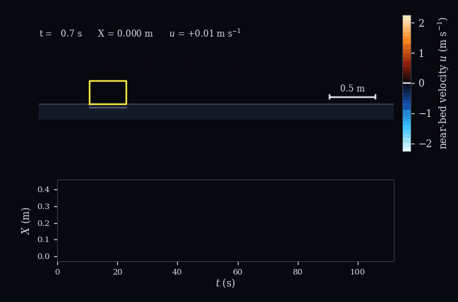
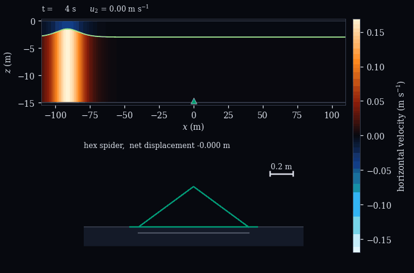
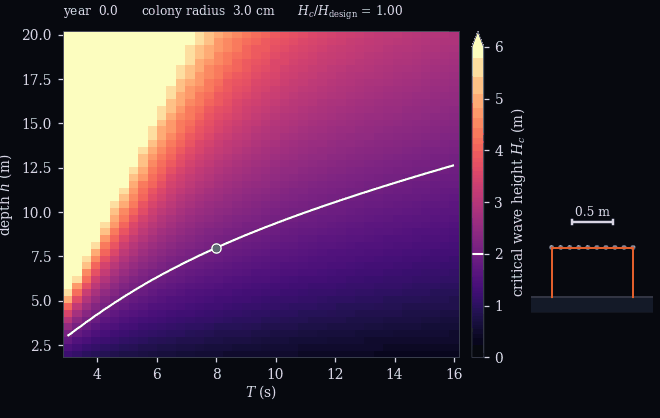

# Supplementary Materials: **A reduced-order model of coral transplant unit stability under waves and currents**

**Authors:** Sandy H. S. Herho, Iwan P. Anwar, Faruq Khadami, Karina A. Sujatmiko, Alfita P. Handayani, and  Dasapta E. Irawan, 

Idealized model of the mechanical failure of coral transplant units under
waves, currents and internal solitary waves, written from scratch in
Python with no calibration and no external data.

A transplant unit is treated as a planar rigid body resting on a rigid
bed, loaded by near-bed wave kinematics through a Morison description and
held by two unilateral frictional contacts.  The model answers a narrow
question that restoration teams face: will this unit stay where it was
placed, as deployed and after the coral on it has grown.  It says nothing
about coral survival, which depends on water quality, sedimentation,
bleaching, attachment technique and maintenance.

<p align="center">
  <br>
  <sub>A wave of period 8 s growing to 3 m over 8 m of water.  Above, the
  linear orbital speed over one and a half wavelengths; below, the stretch
  of bed in the dashed box at true scale, with the five units where the
  contact solver puts them.</sub>
</p>

<table>
  <tr>
    <td align="center" width="50%">
      </td>
    <td align="center" width="50%">
      </td>
  </tr>
  <tr>
    <td align="center"><sub>Waves on a current make a block walk: one
      tread of the staircase per wave, every one in the same
      direction.</sub></td>
    <td align="center"><sub>A two-layer soliton passes, the lower layer
      running with it and the upper layer returning; the spider steps
      downstream while it is overhead.</sub></td>
  </tr>
</table>

<p align="center">
  <br>
  <sub>Critical wave height over depth and period for a staked rebar
  table, recomputed as its colonies grow.  The white contour is the 2 m
  design wave; the monsoon reference condition starts inside it and ends
  outside.</sub>
</p>

## What is in the model

- Five reference structures: solid block, perforated dome, rebar table,
  hexagonal spider, tetrahedral frame.
- Six materials, entering the quasi-static criteria only through the
  submerged weight.
- Forcing: regular and second-order Stokes waves, steady currents, and a
  two-layer Korteweg-de Vries internal solitary wave.
- Dynamics: Moreau-Jean time-stepping with a projected Gauss-Seidel
  contact solve, compiled with Numba, with a NumPy reference
  implementation and two independent event-driven solvers used for
  verification.
- Diagnostics: closed-form thresholds for sliding, tipping and lift-off,
  ratchet asymptotics with their relative-velocity correction, critical
  wave heights over depth and period, and the hold-down force a unit
  needs to meet a stated safety factor.

## Main results

- Sliding precedes tipping if and only if `b/z_p > mu`, and lift cancels
  from that comparison exactly.
- Material choice enters the quasi-static thresholds only through the
  submerged weight; structure controls the mode and the lever arms.
- Waves on a current make a unit walk.  The drift per cycle near
  threshold is `(9/2)(mu N/m_x) eps^2/kappa`, reduced by the factor
  `1 - (6/5) Gamma` because drag acts on the relative velocity.
- An internal solitary wave at transplant depths is a transient current of
  a few tens of centimetres per second lasting a few wave periods.  It
  rarely overturns a unit by itself, and it does trigger net displacement
  in units that are otherwise holding.
- Coral growth erodes the margin it was built for, and mounting height
  matters only once sliding is prevented.
- The ranking of the five structures by critical wave height is
  reproduced in 97.5 percent of 4000 samples that vary every uncalibrated
  coefficient at once, so the ordering is far firmer than the values.

## Layout

```
reefunit/    library: core, units, forcing, kernel, dynamics, reduced,
             statics, ratchet, scenario, draw, plotting, anim, io_utils
scripts/     fig00 ... fig08, anim01 ... anim04, make_reports, run_all
tests/       pytest suite, a fast version of every verification check
outputs/     figures (pdf and png), data (per-panel CSV), reports (txt),
             animations (gif)
```

## Reproducing

```
pip install -r requirements.txt
python scripts/run_all.py              # figures, animations, reports
python scripts/run_all.py figures      # figures only
python scripts/run_all.py animations   # animations only
python -m pytest tests -q              # verification suite, seconds
```

Each figure script writes the data behind its panels to `outputs/data`
and its derived numbers to `outputs/cache`; `make_reports.py` turns those
into the plain-text reports, which hold every number quoted in the
manuscript, the verification residuals, the hold-down table, and the
limitations.

## Figures

| | |
|---|---|
| fig00 | units and the planar load model |
| fig01 | near-bed forcing of the site classes and of a soliton |
| fig02 | failure-mode plane and onset under a ramped current |
| fig03 | critical wave height over depth and period, and by material |
| fig04 | ratchet drift, damping correction, drift rate |
| fig05 | soliton amplitude, margin consumed, displacement per passage |
| fig06 | colony growth against the design wave |
| fig07 | sensitivity to the three weakest assumptions |
| fig08 | verification |

Every animation is rendered from the same solvers as the figures, draws
the units from their own geometry at true scale, and carries a colour bar
in SI units.  Nothing in them is exaggerated for effect.

## Limitations

Planar motion, a rigid flat bed, non-breaking waves, uncalibrated force
coefficients, and a colony model capped at 0.10 m radius.  The unit
dimensions are a parameter set rather than measurements of particular
designs; because the quasi-static thresholds depend on the geometry only
through `W'/(C_D A)` and `z_p/b`, results can be rescaled to another unit
without rerunning anything.  These are stated in full in
`outputs/reports/open_items.txt`.  Nothing here has been validated against
field or laboratory data, so the results are relative and structural
rather than predictive.
